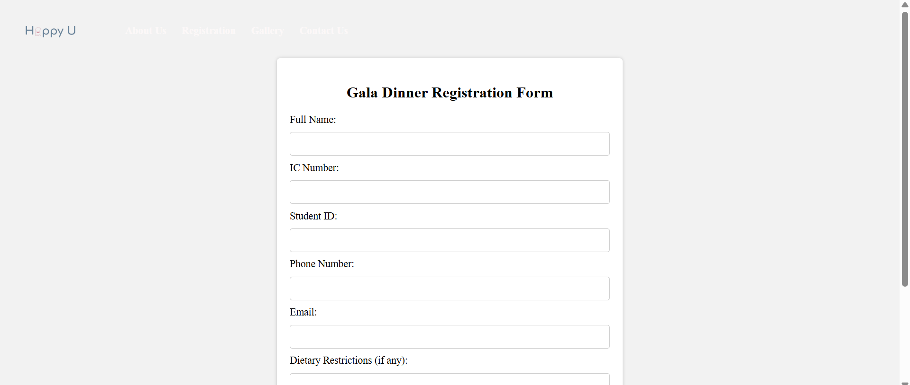
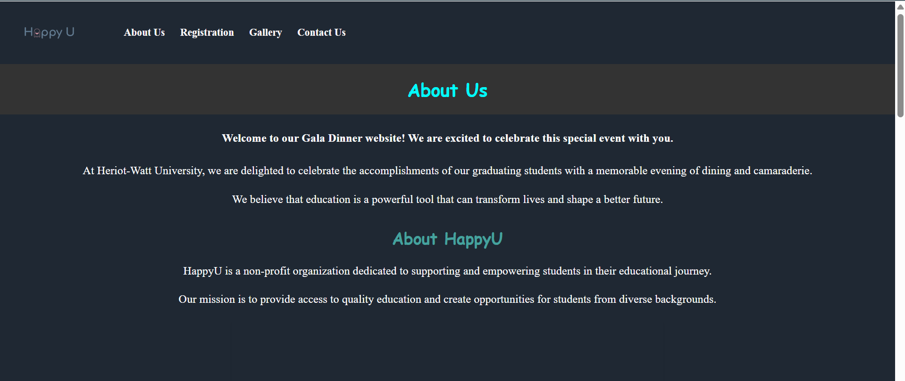
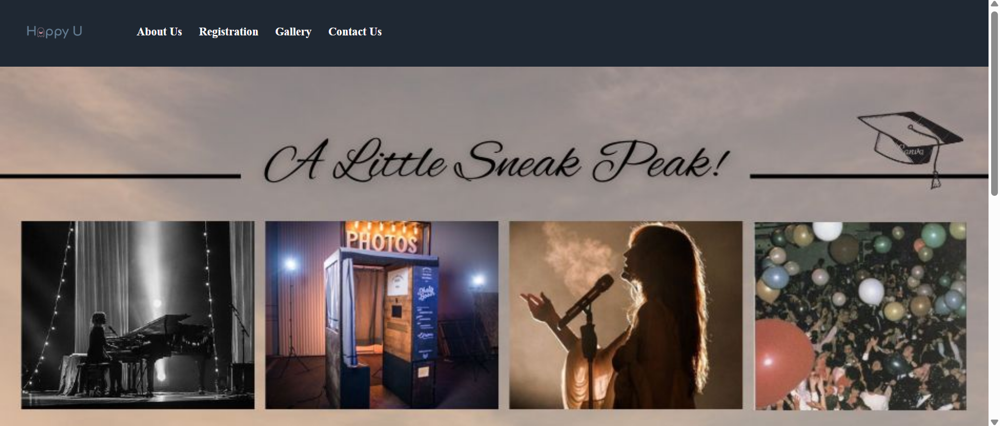
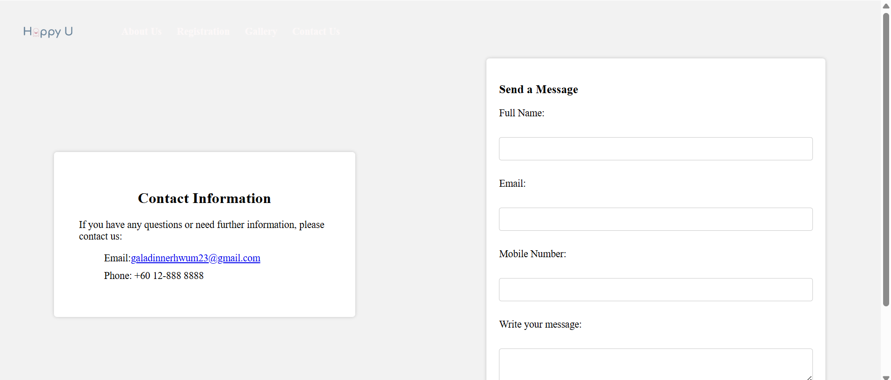

# Gala Dinner Website

This is a simple website for the Gala Dinner 2023 event, developed using HTML, CSS, and PHP with an SQLite database for data storage.

# Features

1. Homepage: Displays event details, including date, time, and venue.
2. Registration Page: Allows users to register for the event.
3. Gallery: Showcases images from past events.
4. Contact Us: Provides a way for users to reach out.

# Technologies Used

1. Frontend: HTML, CSS
2. Backend: PHP
3. Database: SQLite

# Usage

Start XAMPP and ensure Apache is running.
Run the html file to display the website: Home.html

# Design Overview

Homepage

Registration

About Us

Gallery

Contact Us

